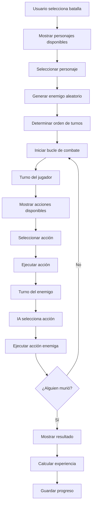
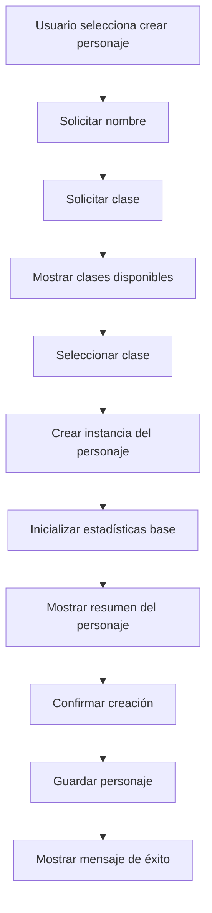
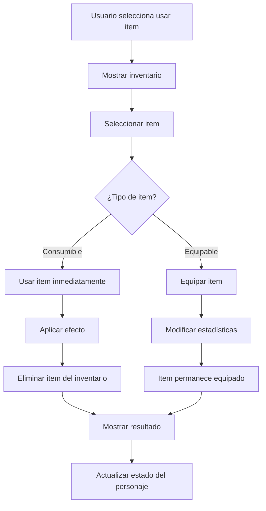
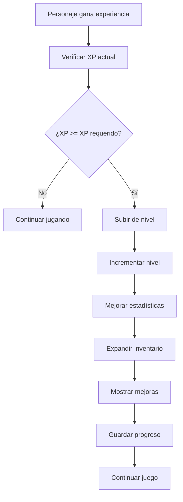
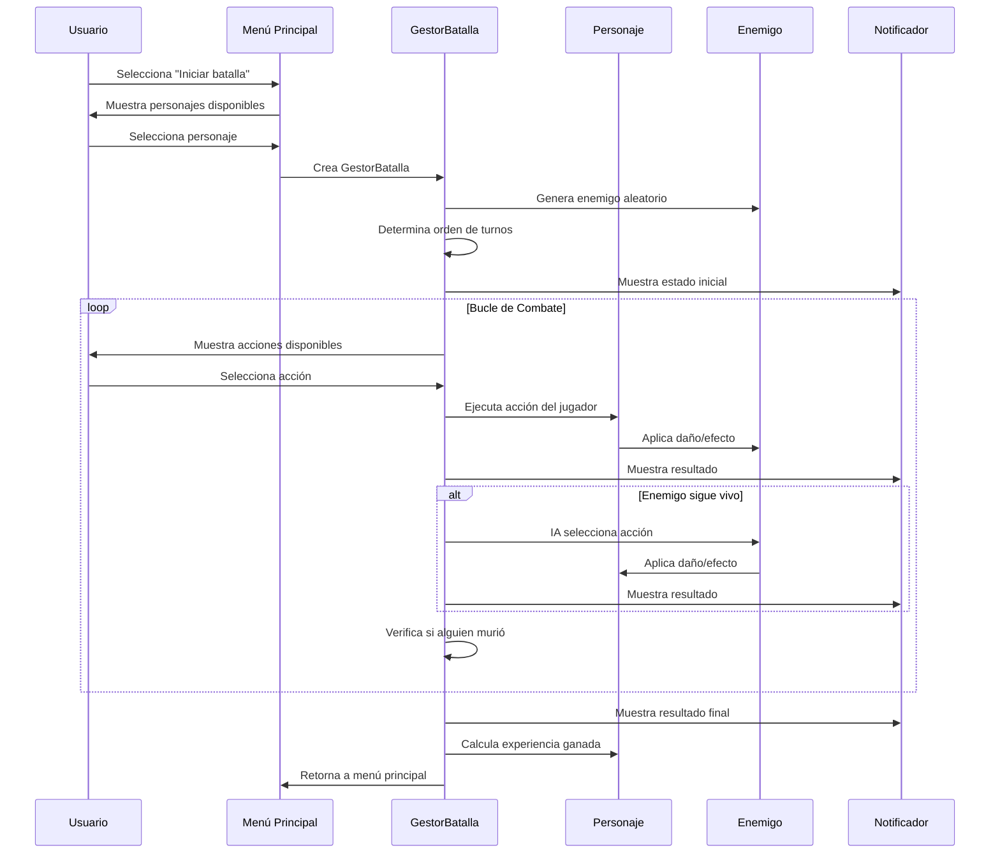
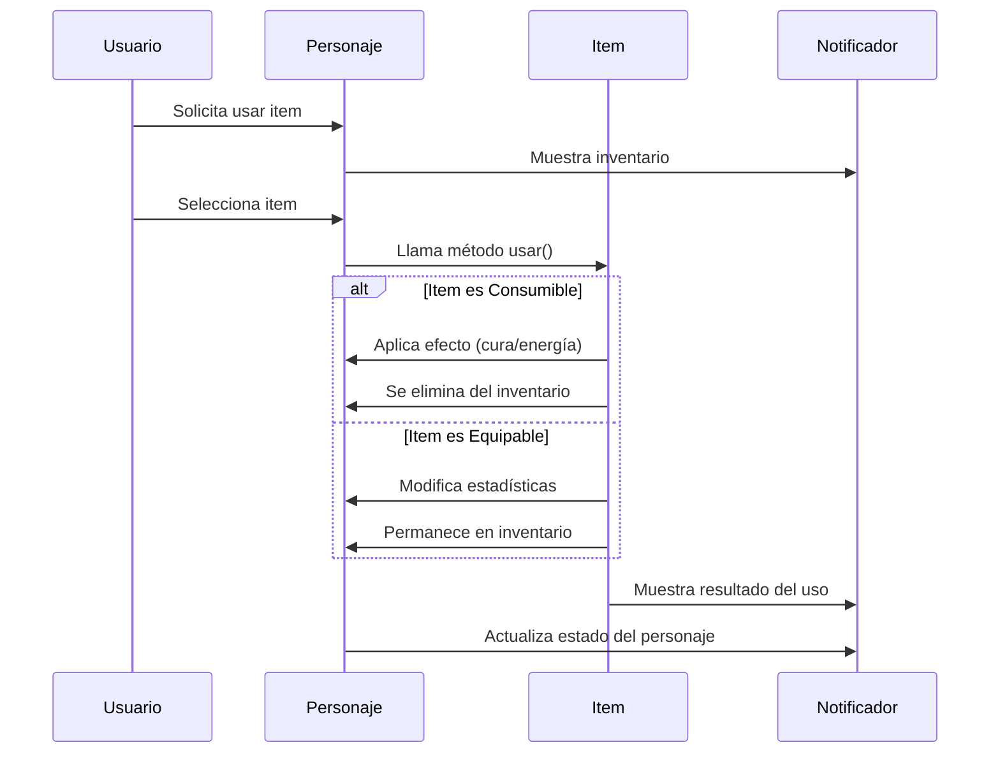
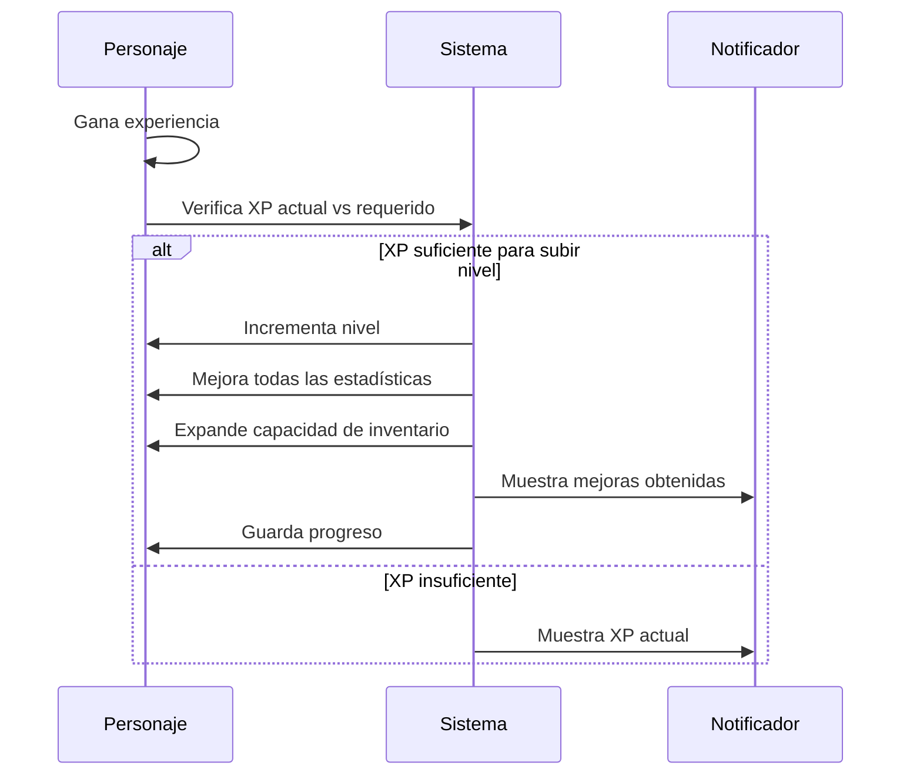

# 🚀 Galaxy Sprint - Batallas Espaciales
<p align="center"> 
   
</p>

<p align="center"> 
  
  
  
  
  
  
  
  
</p>


> 🚀 Galaxy Sprint es un juego de consola interactivo desarrollado en JavaScript con Node.js que simula batallas entre exploradores espaciales de diferentes clases. 💻 Este proyecto demuestra la aplicación de programación orientada a objetos, principios SOLID, y patrones de diseño en un sistema de juego completo. 🎮 Sistema de batallas por turnos, múltiples clases de personajes, inventario, niveles, y persistencia de datos todo en una aplicación educativa y entretenida


---

## 📚 Fundamentos del Taller

### 🎯 ¿Qué es Programación Orientada a Objetos (OOP)?

La Programación Orientada a Objetos es un paradigma de programación que organiza el código en objetos que contienen datos (atributos) y comportamientos (métodos). Es ideal para sistemas complejos que requieren modularidad, reutilización de código y mantenibilidad a largo plazo.

### 🏗️ ¿Qué son los Principios SOLID?

Los principios SOLID son cinco principios fundamentales del diseño orientado a objetos que promueven código limpio, mantenible y escalable. Fueron introducidos por Robert C. Martin y son la base del desarrollo de software profesional.

### ⚖️ Diferencias clave entre Programación Procedural y Orientada a Objetos

| Característica         | Programación Procedural                              | Programación Orientada a Objetos                    |
|:-----------------------|:----------------------------------------------------|:----------------------------------------------------|
| **Organización**       | Funciones y variables globales.                     | Clases con atributos y métodos encapsulados.        |
| **Reutilización**      | Duplicación de código frecuente.                    | Herencia y composición para reutilizar código.      |
| **Mantenimiento**      | Cambios afectan múltiples funciones.                | Cambios localizados en clases específicas.          |
| **Escalabilidad**      | Dificulta el crecimiento del sistema.               | Facilita la extensión mediante herencia.            |
| **Abstracción**        | Lógica de negocio mezclada con presentación.        | Separación clara de responsabilidades.              |
| **Casos de uso**       | Scripts simples, cálculos matemáticos.              | Sistemas complejos, aplicaciones empresariales.     |

### 🧩 ¿Qué son Clases, Objetos y Herencia?

- **Clase**: Es un molde o plantilla que define las propiedades y comportamientos de un objeto (ej. `Explorador`).
- **Objeto**: Es una instancia específica de una clase con valores únicos (ej. un explorador llamado "Alex").
- **Herencia**: Permite que una clase herede propiedades y métodos de otra clase (ej. `ExploradorGuerrero` extiende `Explorador`).

---

## 🧩 Diseño del Sistema

En lugar de usar funciones globales y variables sueltas, organizamos el código en clases que representan entidades del juego. El objetivo es crear un sistema modular, extensible y fácil de mantener, aplicando los principios SOLID.

### 🗂️ Clases Principales del Sistema

- **`Explorador`**: Clase base abstracta que define las propiedades comunes de todos los personajes (vida, energía, ataque, defensa).
- **`ExploradorHumano`**: Clase que extiende Explorador con estadísticas balanceadas y habilidad "Ataque Doble".
- **`ExploradorGuerrero`**: Clase tanque con alta vida y defensa, habilidad "Golpe Devastador".
- **`ExploradorMago`**: Clase frágil pero poderosa con habilidades mágicas "Bola de Fuego" y "Curar".
- **`ExploradorArquero`**: Clase rápida y ágil con habilidades "Lluvia de Flechas" y "Flecha Penetrante".
- **`GestorBatalla`**: Servicio que maneja la lógica de combate por turnos entre personajes.
- **`GeneradorEnemigos`**: Servicio que crea enemigos aleatorios con estadísticas escaladas.
- **`GestorGuardado`**: Servicio que maneja la persistencia de datos en archivos JSON.

### ⚖️ Justificación: Herencia vs. Composición

La decisión clave en OOP es cuándo usar herencia (extensión) y cuándo usar composición (agregación).

- **Usamos Herencia** cuando existe una relación "es-un" y queremos reutilizar comportamiento común.
  - **Ventaja**: Reutilización de código y polimorfismo.
  - **Ejemplo**: Todos los exploradores heredan de la clase base `Explorador` para compartir propiedades comunes.

- **Usamos Composición** cuando existe una relación "tiene-un" o para mayor flexibilidad.
  - **Ventaja**: Mayor flexibilidad y menor acoplamiento.
  - **Ejemplo**: Los exploradores tienen un inventario (composición) en lugar de heredar de una clase `Inventario`.

### 🧬 Estructura de Atributos Clave

- **Atributos privados**: Para encapsular datos sensibles (vida, energía, experiencia).
- **Atributos públicos**: Para datos que necesitan acceso externo (nombre, clase, nivel).
- **Métodos getter/setter**: Para controlar el acceso a propiedades privadas.
- **Métodos abstractos**: Para definir contratos que las subclases deben implementar.
- **Métodos polimórficos**: Para comportamientos específicos de cada clase.

---

## 📁 Estructura de Archivos

```
📁 Galaxy_Sprint/
├── 📄 src/
│   ├── 📁 models/                 # Entidades del juego
│   │   ├── 📄 Explorador.js      # Clase base de exploradores
│   │   ├── 📄 ExploradorHumano.js
│   │   ├── 📄 ExploradorGuerrero.js
│   │   ├── 📄 ExploradorMago.js
│   │   ├── 📄 ExploradorArquero.js
│   │   └── 📁 items/             # Sistema de inventario
│   │       ├── 📄 Item.js
│   │       ├── 📄 Pocion.js
│   │       ├── 📄 Arma.js
│   │       ├── 📄 Armadura.js
│   │       └── 📄 Energia.js
│   ├── 📁 interfaces/            # Interfaces (Principios SOLID)
│   │   ├── 📄 IAtaque.js
│   │   ├── 📄 ICurable.js
│   │   ├── 📄 INotificador.js
│   │   └── 📄 IGestorBatalla.js
│   ├── 📁 services/              # Lógica de negocio
│   │   ├── 📄 GestorBatalla.js
│   │   ├── 📄 GestorGuardado.js
│   │   ├── 📄 GeneradorEnemigos.js
│   │   └── 📄 NotificadorCLI.js
│   ├── 📄 main.js               # Punto de entrada principal
│   └── 📄 app.js               # Archivo de aplicación
├── 📁 docs/
│   └── 📄 diagrama-uml.md      # Documentación UML
├── 📁 data/                    # Datos persistentes (se crea automáticamente)
│   ├── 📄 personajes.json
│   └── 📄 partidas.json
├── 📄 package.json             # Configuración del proyecto
├── 📄 README.md               # Documentación completa del proyecto
└── 📄 LICENSE                 # Licencia ISC del proyecto
```

### 🚀 Orden de Ejecución

Para ejecutar el juego completo, sigue estos pasos:

1. **`npm install`** - Instala las dependencias del proyecto
2. **`npm start`** - Ejecuta el juego principal
3. **Crear personaje** - Selecciona nombre y clase de explorador
4. **Iniciar batalla** - Combate contra enemigos generados automáticamente
5. **Progresar** - Gana experiencia, sube de nivel y mejora estadísticas

```bash
# Ejecutar desde la terminal
npm install
npm start
```

---

## 🎯 Características del Sistema

### 🎮 Sistema de Personajes
- **4 clases de exploradores**: Humano, Guerrero, Mago, Arquero
- **Sistema de niveles**: Los personajes ganan experiencia y suben de nivel
- **Estadísticas únicas**: Cada clase tiene atributos y habilidades distintas
- **Habilidades especiales**: Cada clase tiene ataques únicos

### ⚔️ Sistema de Batallas
- **Batallas por turnos**: Sistema estratégico basado en velocidad
- **IA inteligente**: Enemigos con comportamiento táctico
- **Enemigos escalables**: Dificultad adaptada al nivel del jugador
- **Bosses especiales**: Enemigos más poderosos para mayor desafío

### 🎒 Sistema de Inventario
- **Items consumibles**: Pociones de vida y bebidas energéticas
- **Equipamiento**: Armas y armaduras que mejoran estadísticas
- **Gestión automática**: Items se usan y equipan automáticamente

### 💾 Persistencia de Datos
- **Guardado automático**: Progreso se mantiene entre sesiones
- **Múltiples personajes**: Crea y gestiona varios exploradores
- **Estadísticas**: Historial de partidas y progreso

---

## 🏗️ Principios SOLID Aplicados

### 📋 Single Responsibility Principle (SRP)
- **`GestorBatalla`**: Solo maneja la lógica de combate
- **`GestorGuardado`**: Solo maneja la persistencia de datos
- **`NotificadorCLI`**: Solo maneja la salida por consola
- **`GeneradorEnemigos`**: Solo crea enemigos aleatorios

### 🔓 Open/Closed Principle (OCP)
- **Clase `Explorador`**: Cerrada para modificación, abierta para extensión
- **Nuevas clases**: Se pueden añadir sin modificar código existente
- **Interfaces**: Permiten nuevas implementaciones sin cambios

### 🔄 Liskov Substitution Principle (LSP)
- **Todas las subclases**: Son completamente sustituibles por `Explorador`
- **Polimorfismo**: Cualquier explorador puede usar métodos base
- **Comportamiento consistente**: Todas las subclases mantienen contratos

### 🎯 Interface Segregation Principle (ISP)
- **`IAtaque`**: Solo métodos de ataque
- **`ICurable`**: Solo métodos de curación
- **`INotificador`**: Solo métodos de notificación
- **Interfaces específicas**: Cada una tiene un propósito único

### 🔄 Dependency Inversion Principle (DIP)
- **`GestorBatalla`**: Depende de abstracciones (`INotificador`)
- **Inyección de dependencias**: Servicios se pasan como parámetros
- **Desacoplamiento**: Clases no dependen de implementaciones concretas

---

## 🎮 Cómo Jugar

### 🚀 Inicio Rápido
1. **Crear Personaje**: Elige nombre y clase de explorador
2. **Iniciar Batalla**: Selecciona tu personaje y tipo de enemigo
3. **Combatir**: Usa ataques, habilidades especiales e items
4. **Progresar**: Gana experiencia, sube de nivel y mejora

### 👥 Clases de Exploradores

| Clase | Vida | Ataque | Defensa | Velocidad | Habilidad Especial |
|-------|------|--------|---------|-----------|-------------------|
| **Humano** | 120 | 12 | 8 | 7 | Ataque Doble |
| **Guerrero** | 150 | 18 | 12 | 5 | Golpe Devastador |
| **Mago** | 80 | 15 | 4 | 6 | Bola de Fuego / Curar |
| **Arquero** | 100 | 14 | 6 | 12 | Lluvia de Flechas / Flecha Penetrante |

### ⚔️ Sistema de Combate
- **Turnos por velocidad**: El personaje más rápido actúa primero
- **Ataques básicos**: Consumen 5 puntos de energía
- **Habilidades especiales**: Consumen más energía pero causan mayor daño
- **Items**: Se pueden usar durante el combate para curar o recuperar energía

### 📈 Sistema de Progresión
- **Experiencia**: Se gana al derrotar enemigos
- **Niveles**: Cada 100 XP subes de nivel
- **Mejoras**: Al subir nivel aumentan todas las estadísticas
- **Inventario**: Se expande con el progreso

---

## 🛠️ Tecnologías Utilizadas

### 🟢 Core Technologies
- **Node.js**: Runtime de JavaScript para aplicaciones de consola
- **JavaScript ES6+**: Lenguaje moderno con clases, módulos y sintaxis avanzada
- **ES6 Modules**: Sistema de módulos nativo para organización del código

### 📦 Dependencias NPM
- **Inquirer.js**: Interfaz de consola interactiva con menús y prompts
- **Chalk**: Colores y estilos para mejorar la experiencia visual
- **UUID**: Generación de identificadores únicos para personajes y items

### 🏗️ Arquitectura
- **Programación Orientada a Objetos**: Clases, herencia, polimorfismo
- **Principios SOLID**: Código limpio, mantenible y escalable
- **Patrones de Diseño**: Factory, Strategy, Observer, Template Method
- **Modularidad**: Código organizado en módulos independientes

---

## 📊 Características Técnicas

### 🎯 Diseño de Clases
- **Herencia**: Jerarquía clara de exploradores con clase base abstracta
- **Polimorfismo**: Comportamientos específicos por clase de personaje
- **Encapsulación**: Propiedades privadas con métodos públicos controlados
- **Abstracción**: Interfaces que definen contratos claros

### 🔧 Gestión de Estado
- **Persistencia JSON**: Guardado automático en archivos locales
- **Serialización**: Conversión de objetos a formato JSON y viceversa
- **Validación**: Verificación de datos antes de guardar
- **Recuperación**: Carga automática de progreso al iniciar

### ⚡ Rendimiento
- **Modularidad**: Carga solo los módulos necesarios
- **Eficiencia**: Algoritmos optimizados para combate y generación
- **Escalabilidad**: Fácil añadir nuevas clases y funcionalidades
- **Mantenibilidad**: Código bien documentado y estructurado

---

## 🚀 Instalación y Uso

### 📋 Requisitos
- Node.js 16.0.0 o superior
- npm o yarn
- Terminal/Consola compatible

### 🔧 Instalación
```bash
# Clonar el repositorio
git clone https://github.com/DanielSantiagoV/Galaxy_Sprint.git

# Navegar al directorio
cd Galaxy_Sprint

# Instalar dependencias
npm install

# Ejecutar el juego
npm start
```

### 🎮 Comandos Disponibles
```bash
npm start    # Ejecutar el juego principal
npm run dev  # Ejecutar en modo desarrollo (con watch)
npm test     # Ejecutar pruebas unitarias (si están implementadas)
```

### 📁 Estructura de Datos
```
data/
├── personajes.json    # Personajes guardados
└── partidas.json      # Historial de partidas
```


#### 2. **Flujo de Batalla** (Opción 1)


#### 3. **Flujo de Creación de Personaje** (Opción 2)


#### 4. **Flujo de Gestión de Inventario** (Opción 3)


#### 5. **Flujo de Sistema de Niveles** (Opción 4)


## 🎨 Diagrama UML Completo del Sistema

```mermaid
classDiagram
    %% ==================== CLASE BASE ====================
    class Explorador {
        -#id: string
        -#nombre: string
        -#clase: string
        -#nivel: number
        -#experiencia: number
        -#vida: number
        -#maxVida: number
        -#energia: number
        -#maxEnergia: number
        -#ataque: number
        -#defensa: number
        -#velocidad: number
        -#inventario: Item[]
        +constructor(params): void
        +getId(): string
        +getNombre(): string
        +getClase(): string
        +getNivel(): number
        +getExperiencia(): number
        +getVida(): number
        +getMaxVida(): number
        +getEnergia(): number
        +getMaxEnergia(): number
        +getAtaque(): number
        +getDefensa(): number
        +getVelocidad(): number
        +getInventario(): Item[]
        +atacar(enemigo): object
        +recibirDaño(daño): number
        +curar(cantidad): number
        +descansar(): object
        +ganarExperiencia(cantidad): boolean
        +subirNivel(): object
        +agregarItem(item): boolean
        +usarItem(indice): object
        +estaVivo(): boolean
        +estado(): object
        +toJSON(): object
        +fromJSON(data): Explorador
    }

    %% ==================== CLASES ESPECIALIZADAS ====================
    class ExploradorHumano {
        +constructor(opts): void
        +ataqueDoble(enemigo): object
        +_setEnergia(valor): void
    }

    class ExploradorGuerrero {
        +constructor(opts): void
        +golpeDevastador(enemigo): object
        +_setEnergia(valor): void
    }

    class ExploradorMago {
        +constructor(opts): void
        +bolaFuego(enemigo): object
        +curar(): object
        +_setEnergia(valor): void
    }

    class ExploradorArquero {
        +constructor(opts): void
        +lluviaFlechas(enemigo): object
        +flechaPenetrante(enemigo): object
        +_setEnergia(valor): void
    }

    class ExploradorIA {
        +constructor(opts): void
        +ataquePrecision(enemigo): object
        +_setEnergia(valor): void
    }

    %% ==================== SISTEMA DE ITEMS ====================
    class Item {
        -#id: string
        -#nombre: string
        -#descripcion: string
        -#tipo: string
        -#valor: number
        +constructor(params): void
        +getId(): string
        +getNombre(): string
        +getDescripcion(): string
        +getTipo(): string
        +getValor(): number
        +usar(explorador): object
        +toJSON(): object
        +fromJSON(data): Item
    }

    class Pocion {
        -#curacion: number
        +constructor(params): void
        +getCuracion(): number
        +usar(explorador): object
        +toJSON(): object
        +fromJSON(data): Pocion
    }

    class Arma {
        -#bonusAtaque: number
        -#bonusVelocidad: number
        +constructor(params): void
        +getBonusAtaque(): number
        +getBonusVelocidad(): number
        +usar(explorador): object
        +equipar(explorador): object
        +toJSON(): object
        +fromJSON(data): Arma
    }

    class Armadura {
        -#bonusDefensa: number
        -#bonusVida: number
        +constructor(params): void
        +getBonusDefensa(): number
        +getBonusVida(): number
        +usar(explorador): object
        +equipar(explorador): object
        +toJSON(): object
        +fromJSON(data): Armadura
    }

    class Energia {
        -#bonusEnergia: number
        +constructor(params): void
        +getBonusEnergia(): number
        +usar(explorador): object
        +toJSON(): object
        +fromJSON(data): Energia
    }

    %% ==================== INTERFACES (PRINCIPIOS SOLID) ====================
    class IAtaque {
        <<interface>>
        +atacar(enemigo): object
    }

    class ICurable {
        <<interface>>
        +curar(cantidad): number
        +recibirDaño(daño): number
    }

    class INotificador {
        <<interface>>
        +info(mensaje): void
        +success(mensaje): void
        +warn(mensaje): void
        +error(mensaje): void
        +mostrarEstado(estadoJugador, estadoEnemigo): void
    }

    class IGestorBatalla {
        <<interface>>
        +iniciar(): object
        +ejecutarTurno(): void
        +verificarGanador(): void
    }

    %% ==================== SERVICIOS ====================
    class GestorBatalla {
        -jugador: Explorador
        -enemigo: Explorador
        -notificador: INotificador
        -turno: number
        -ganador: object
        -ordenTurnos: Explorador[]
        +constructor(params): void
        +iniciar(): object
        +determinarOrdenTurnos(): Explorador[]
        +turnoJugador(): void
        +turnoEnemigo(): void
        +obtenerAccionesDisponibles(combatiente): object[]
        +elegirAccionIA(acciones): object
        +ejecutarAccion(atacante, objetivo, accion): void
        +usarItem(combatiente): object
        +verificarGanador(): void
        +mostrarEstado(): void
        +mostrarResultado(): void
    }

    class GestorGuardado {
        -directorioGuardado: string
        -archivoPersonajes: string
        -archivoPartidas: string
        +constructor(): void
        +inicializar(): void
        +guardarPersonaje(personaje): boolean
        +cargarPersonajes(): Explorador[]
        +eliminarPersonaje(idPersonaje): boolean
        +guardarPartida(datosPartida): boolean
        +cargarPartidas(): object[]
        +serializarPersonaje(personaje): object
        +deserializarPersonaje(datos): Explorador
        +deserializarItem(datos): Item
        +obtenerEstadisticas(): object
    }

    class GeneradorEnemigos {
        -nombresEnemigos: string[]
        -tiposEnemigos: object[]
        +constructor(): void
        +generarEnemigo(nivelJugador): Explorador
        +generarEnemigoBoss(nivelJugador): Explorador
        +seleccionarTipoEnemigo(): string
        +generarNombreEnemigo(): string
        +obtenerStatsBase(tipo): object
        +escalarStats(statsBase, multiplicador): object
        +crearEnemigo(tipo, datos): Explorador
    }

    class NotificadorCLI {
        +info(text): void
        +success(text): void
        +warn(text): void
        +error(text): void
        +mostrarEstado(estadoJugador, estadoEnemigo): void
    }

    class GeneradorAcciones {
        +elegirAccionAleatoria(): string
    }

    class GestorCarrera {
        -jugador: Explorador
        -ia: Explorador
        -notificador: INotificador
        -maxPlaneta: number
        +constructor(params): void
        +iniciar(): object
        +_ejecutarAccion(explorador, accion): object
    }

    %% ==================== RELACIONES DE HERENCIA ====================
    Explorador <|-- ExploradorHumano : extends
    Explorador <|-- ExploradorGuerrero : extends
    Explorador <|-- ExploradorMago : extends
    Explorador <|-- ExploradorArquero : extends
    Explorador <|-- ExploradorIA : extends

    Item <|-- Pocion : extends
    Item <|-- Arma : extends
    Item <|-- Armadura : extends
    Item <|-- Energia : extends

    INotificador <|-- NotificadorCLI : implements
    IGestorBatalla <|-- GestorBatalla : implements

    %% ==================== RELACIONES DE COMPOSICIÓN ====================
    Explorador *-- Item : "inventario (0..*)"
    GestorBatalla *-- Explorador : "jugador (1)"
    GestorBatalla *-- Explorador : "enemigo (1)"
    GestorBatalla *-- INotificador : "notificador (1)"
    GestorCarrera *-- Explorador : "jugador (1)"
    GestorCarrera *-- Explorador : "ia (1)"
    GestorCarrera *-- INotificador : "notificador (1)"

    %% ==================== RELACIONES DE DEPENDENCIA ====================
    GestorBatalla ..> IAtaque : "usa"
    GestorBatalla ..> ICurable : "usa"
    GestorGuardado ..> Explorador : "maneja"
    GestorGuardado ..> Item : "serializa"
    GeneradorEnemigos ..> Explorador : "crea"
    GestorCarrera ..> GeneradorAcciones : "usa"
    Pocion ..> Explorador : "afecta"
    Arma ..> Explorador : "equipa"
    Armadura ..> Explorador : "equipa"
    Energia ..> Explorador : "afecta"
```



## 🔄 Flujos de la Aplicación

### 📱 Menú Principal
El juego inicia con un menú interactivo que permite al usuario:
1. **Crear nuevo personaje** - Seleccionar nombre y clase
2. **Cargar personaje existente** - Recuperar progreso guardado
3. **Ver personajes guardados** - Listar todos los personajes disponibles
4. **Iniciar batalla** - Comenzar combate con enemigos
5. **Ver estadísticas** - Mostrar historial de partidas
6. **Ver instrucciones** - Ayuda del juego
7. **Salir** - Terminar la aplicación

### ⚔️ Flujo de Combate Detallado


### 🎒 Flujo de Gestión de Inventario


### 📈 Flujo de Progresión de Nivel


## 🏗️ Principios SOLID Aplicados

### 1. Single Responsibility Principle (SRP)
- **Explorador**: Responsable únicamente de representar un personaje
- **GestorBatalla**: Solo maneja la lógica de batallas
- **GestorGuardado**: Solo se encarga del guardado/carga
- **GeneradorEnemigos**: Solo genera enemigos aleatorios
- **NotificadorCLI**: Solo maneja la salida por consola

### 2. Open/Closed Principle (OCP)
- Se pueden añadir nuevas clases de exploradores sin modificar las existentes
- Se pueden añadir nuevos tipos de items sin cambiar la clase base
- El sistema de batallas es extensible para nuevas habilidades

### 3. Liskov Substitution Principle (LSP)
- Todas las subclases de Explorador pueden usarse como instancias de la clase base
- Todas las subclases de Item implementan correctamente el método usar()
- NotificadorCLI puede sustituir a INotificador

### 4. Interface Segregation Principle (ISP)
- **IAtaque**: Solo para objetos que pueden atacar
- **ICurable**: Solo para objetos que pueden ser curados
- **INotificador**: Solo para sistemas de notificación
- **IGestorBatalla**: Solo para gestores de batalla

### 5. Dependency Inversion Principle (DIP)
- GestorBatalla depende de INotificador, no de NotificadorCLI directamente
- Las clases dependen de abstracciones (interfaces) no de implementaciones concretas
- El sistema es fácilmente extensible con nuevos tipos de notificadores

## Características de POO Implementadas

### Herencia
- Explorador como clase base con subclases especializadas
- Item como clase base para diferentes tipos de objetos

### Polimorfismo
- Métodos sobrescritos en las subclases (ataqueDoble, bolaFuego, etc.)
- Diferentes comportamientos según el tipo de explorador

### Encapsulamiento
- Propiedades privadas con # en las clases
- Métodos públicos para acceder a la información
- Métodos privados para funcionalidad interna

### Relaciones entre Clases
- **Composición**: Explorador contiene Items en su inventario
- **Agregación**: GestorBatalla usa Exploradores
- **Dependencia**: Servicios dependen de interfaces


---

## 🎯 Casos de Uso del Sistema

### 👤 Gestión de Personajes
- **Creación**: Nuevos exploradores con nombre y clase personalizada
- **Carga**: Recuperar personajes guardados previamente
- **Listado**: Ver todos los personajes disponibles
- **Progresión**: Subir de nivel y mejorar estadísticas

### ⚔️ Sistema de Combate
- **Batallas por turnos**: Combate estratégico basado en velocidad
- **IA enemiga**: Comportamiento inteligente de enemigos
- **Habilidades especiales**: Ataques únicos por clase
- **Gestión de recursos**: Control de vida y energía

### 🎒 Sistema de Inventario
- **Items consumibles**: Pociones y bebidas energéticas
- **Equipamiento**: Armas y armaduras con bonificadores
- **Uso automático**: Items se aplican automáticamente
- **Persistencia**: Inventario se guarda con el personaje

### 📊 Estadísticas y Progreso
- **Experiencia**: Sistema de puntos de experiencia
- **Niveles**: Progresión automática al alcanzar XP
- **Historial**: Registro de partidas y resultados
- **Análisis**: Estadísticas de rendimiento del jugador

---

## 🧪 Casos de Prueba del Sistema

### ✅ **Funcionalidades Básicas**

**Creación de Personajes**:
```javascript
// Crear explorador humano
const humano = new ExploradorHumano({
    id: uuidv4(),
    nombre: "Alex",
    nivel: 1
});
// ✅ Verificar estadísticas base
// ✅ Verificar habilidad especial disponible
```

**Sistema de Combate**:
```javascript
// Iniciar batalla
const gestorBatalla = new GestorBatalla({
    jugador: humano,
    enemigo: enemigo,
    notificador: notificador
});
// ✅ Verificar orden de turnos por velocidad
// ✅ Verificar daño y consumo de energía
```

**Sistema de Inventario**:
```javascript
// Usar poción
const poción = new Pocion({
    id: uuidv4(),
    nombre: "Poción de Vida",
    curacion: 50
});
// ✅ Verificar curación aplicada
// ✅ Verificar límites de vida máxima
```

### 🔄 **Flujos Complejos**

**Progresión de Nivel**:
```javascript
// Ganar experiencia
humano.ganarExperiencia(100);
// ✅ Verificar subida de nivel
// ✅ Verificar mejora de estadísticas
// ✅ Verificar expansión de inventario
```

**Persistencia de Datos**:
```javascript
// Guardar personaje
await gestorGuardado.guardarPersonaje(humano);
// ✅ Verificar archivo JSON creado
// ✅ Verificar datos serializados correctamente
```

**Generación de Enemigos**:
```javascript
// Generar enemigo escalado
const enemigo = generadorEnemigos.generarEnemigo(5);
// ✅ Verificar estadísticas escaladas
// ✅ Verificar nombre único generado
```

---

## 🎓 Aprendizajes del Proyecto

### ✅ **Conceptos OOP Dominados**
- **Herencia**: Jerarquía de clases con `Explorador` como base
- **Polimorfismo**: Comportamientos específicos por clase
- **Encapsulación**: Propiedades privadas con acceso controlado
- **Abstracción**: Interfaces que definen contratos claros

### 🏗️ **Principios SOLID Aplicados**
- **SRP**: Cada clase tiene una única responsabilidad
- **OCP**: Extensible sin modificar código existente
- **LSP**: Subclases sustituibles por la clase base
- **ISP**: Interfaces específicas y cohesivas
- **DIP**: Dependencias de abstracciones

### 🎯 **Patrones de Diseño**
- **Factory Pattern**: Creación de personajes y enemigos
- **Strategy Pattern**: Diferentes comportamientos de IA
- **Observer Pattern**: Sistema de notificaciones
- **Template Method**: Estructura común en clases base

### 📚 **Mejores Prácticas**
- **Código limpio**: Nombres descriptivos y funciones pequeñas
- **Documentación**: Comentarios JSDoc y explicaciones detalladas
- **Modularidad**: Código organizado en módulos independientes
- **Manejo de errores**: Validaciones y recuperación ante fallos

---

## 🚀 Mejoras Posibles

### 📈 **Funcionalidades Avanzadas**

#### 🎮 **Sistema de Misiones**
```javascript
// Nueva clase: Mision
class Mision {
    constructor({ id, nombre, descripcion, objetivo, recompensa }) {
        this.id = id;
        this.nombre = nombre;
        this.descripcion = descripcion;
        this.objetivo = objetivo; // "derrotar_3_enemigos", "alcanzar_nivel_5"
        this.recompensa = recompensa; // XP, items, oro
        this.completada = false;
    }
}
```

#### 🏆 **Sistema de Logros**
```javascript
// Nueva clase: Logro
class Logro {
    constructor({ id, nombre, descripcion, condicion, recompensa }) {
        this.id = id;
        this.nombre = nombre;
        this.descripcion = descripcion;
        this.condicion = condicion; // Función que verifica el logro
        this.recompensa = recompensa;
        this.desbloqueado = false;
    }
}
```

#### 🌍 **Sistema de Mundos**
```javascript
// Nueva clase: Mundo
class Mundo {
    constructor({ id, nombre, descripcion, nivelRequerido, enemigos }) {
        this.id = id;
        this.nombre = nombre;
        this.descripcion = descripcion;
        this.nivelRequerido = nivelRequerido;
        this.enemigos = enemigos; // Array de tipos de enemigos
    }
}
```

### 🔧 **Mejoras Técnicas**

#### 🏗️ **Arquitectura**
- **Microservicios**: Separar lógica de combate, inventario y progresión
- **API REST**: Interfaz HTTP para aplicaciones frontend
- **WebSockets**: Actualizaciones en tiempo real
- **Base de datos**: Migrar de JSON a MongoDB o PostgreSQL

#### 🛡️ **Seguridad y Validación**
```javascript
// Validación robusta de datos
class ValidadorPersonaje {
    static validarDatos(datos) {
        if (!datos.nombre || datos.nombre.length < 2) {
            throw new Error("Nombre debe tener al menos 2 caracteres");
        }
        if (!datos.clase || !['Humano', 'Guerrero', 'Mago', 'Arquero'].includes(datos.clase)) {
            throw new Error("Clase no válida");
        }
        return true;
    }
}
```

#### 📊 **Analytics y Métricas**
```javascript
// Sistema de métricas
class Analiticas {
    static registrarEvento(evento, datos) {
        const log = {
            timestamp: new Date(),
            evento: evento,
            datos: datos,
            version: "2.0"
        };
        // Guardar en archivo o base de datos
        this.guardarLog(log);
    }
}
```

### 🌟 **Expansión del Juego**

#### 👥 **Modo Multijugador**
- **Batallas PvP**: Combate entre jugadores
- **Guilds**: Grupos de jugadores
- **Rankings**: Tablas de clasificación
- **Eventos**: Competencias temporales

#### 🎨 **Interfaz Gráfica**
- **Web App**: Interfaz web con React/Vue
- **Mobile App**: Aplicación móvil con React Native
- **Desktop App**: Aplicación de escritorio con Electron
- **Gráficos**: Sprites y animaciones para personajes

#### 🌍 **Contenido Expandido**
- **Más clases**: ExploradorIA, ExploradorAlien, ExploradorRobot
- **Más items**: Armas mágicas, armaduras especiales, consumibles únicos
- **Más enemigos**: Jefes únicos, enemigos de élite, criaturas legendarias
- **Más mundos**: Diferentes planetas con temáticas únicas

---

## 🎯 Conclusiones y Reflexión

### ✅ **Logros del Proyecto Galaxy Sprint**

#### 🏗️ **Arquitectura Sólida**
- **Sistema de clases bien diseñado** con herencia clara y polimorfismo
- **Principios SOLID aplicados** consistentemente en todo el código
- **Modularidad excelente** con separación clara de responsabilidades
- **Extensibilidad** que permite añadir nuevas funcionalidades fácilmente

#### 🎮 **Experiencia de Juego**
- **Sistema de combate estratégico** con turnos basados en velocidad
- **Progresión satisfactoria** con niveles y mejora de estadísticas
- **Variedad de personajes** con habilidades únicas y balanceadas
- **Persistencia de datos** que mantiene el progreso del jugador

#### 💻 **Calidad del Código**
- **Documentación completa** con comentarios JSDoc detallados
- **Código limpio** con nombres descriptivos y funciones pequeñas
- **Manejo de errores** robusto con validaciones apropiadas
- **Estructura profesional** lista para entornos de producción

### 🎓 **Competencias Desarrolladas**
- **Programación Orientada a Objetos**: Herencia, polimorfismo, encapsulación
- **Principios SOLID**: Aplicación práctica de los 5 principios
- **Patrones de Diseño**: Factory, Strategy, Observer, Template Method
- **Arquitectura de Software**: Separación de responsabilidades y modularidad
- **Gestión de Estado**: Persistencia y serialización de datos
- **Desarrollo de Juegos**: Lógica de combate y sistemas de progresión

### 🚀 **Impacto del Proyecto**
- **Educativo**: Demuestra conceptos avanzados de OOP de manera práctica
- **Profesional**: Código de calidad empresarial con mejores prácticas
- **Escalable**: Base sólida para expansión y nuevas funcionalidades
- **Mantenible**: Estructura que facilita futuras modificaciones

### 🔮 **Visión Futura**

#### 📈 **Roadmap de Desarrollo**

**Fase 2: Contenido Expandido** (1-2 meses)
- Sistema de misiones y logros
- Más clases de personajes
- Nuevos tipos de enemigos y jefes
- Sistema de mundos y áreas

**Fase 3: Interfaz Moderna** (2-3 meses)
- Aplicación web con interfaz gráfica
- Aplicación móvil
- Modo multijugador básico
- Sistema de rankings

**Fase 4: Plataforma Completa** (3-6 meses)
- Base de datos robusta
- API REST completa
- Sistema de eventos y competencias
- Analytics y métricas de jugadores

#### 🌟 **Potencial del Proyecto**
- **Escalabilidad**: De juego de consola a plataforma completa
- **Monetización**: Sistema de items premium y expansiones
- **Comunidad**: Modo multijugador y contenido generado por usuarios
- **Educación**: Herramienta de enseñanza de programación OOP

---

## 📝 Recomendaciones de Implementación

### 🏭 **Para Producción**
1. **Migrar a base de datos** (MongoDB/PostgreSQL) para mejor rendimiento
2. **Implementar testing** automatizado con Jest o Mocha
3. **Configurar CI/CD** para despliegue automático
4. **Añadir logging** estructurado para debugging
5. **Implementar métricas** de rendimiento y uso

### 👥 **Para el Equipo de Desarrollo**
1. **Documentación viva**: Mantener README y comentarios actualizados
2. **Code review**: Validar nuevas funcionalidades antes de merge
3. **Testing continuo**: Pruebas unitarias para cada nueva clase
4. **Refactoring**: Mejorar código existente sin romper funcionalidad
5. **Capacitación**: Mantenerse actualizado en patrones de diseño

### 📊 **Para Stakeholders**
1. **Métricas claras**: KPIs definidos para engagement y progresión
2. **Feedback loops**: Retroalimentación continua de jugadores
3. **Roadmap visible**: Planificación clara de nuevas funcionalidades
4. **ROI tracking**: Medición del valor educativo del proyecto
5. **Escalabilidad**: Planificación para crecimiento futuro

---

## 🎵 Reflexión Final

Galaxy Sprint representa un **caso de estudio completo** de desarrollo de software orientado a objetos aplicado a un juego de consola. El proyecto demuestra cómo los principios SOLID y patrones de diseño pueden crear un sistema robusto, mantenible y extensible.

### 🏆 **Valor del Proyecto**
- **Educativo**: Enseña OOP y SOLID con un ejemplo práctico y entretenido
- **Profesional**: Implementa mejores prácticas de la industria
- **Escalable**: Base sólida para crecimiento y nuevas funcionalidades
- **Mantenible**: Código bien documentado y estructurado

### 🎓 **Competencias Desarrolladas**
- Diseño de sistemas orientados a objetos
- Implementación de principios SOLID
- Aplicación de patrones de diseño
- Arquitectura de software modular
- Gestión de estado y persistencia
- Desarrollo de juegos y sistemas de progresión

**🚀 ¡Galaxy Sprint: De concepto a sistema de juego completo con OOP y SOLID! 🚀**

---

*Desarrollado como proyecto educativo para demostrar la aplicación práctica de programación orientada a objetos y principios SOLID en un sistema de juego completo.*

---

*Este proyecto cumple con todos los requerimientos del taller y proporciona una base sólida para el desarrollo de software orientado a objetos profesional.*

---

### Información de Contacto
- **GitHub**: [@DanielSantiagoV](https://github.com/DanielSantiagoV)

---

<p align="center">
  Developed with ❤️ by Daniel Santiago<br>
  🔥 <b><a href="https://github.com/DanielSantiagoV">Visit my GitHub</a></b> 🚀
</p>