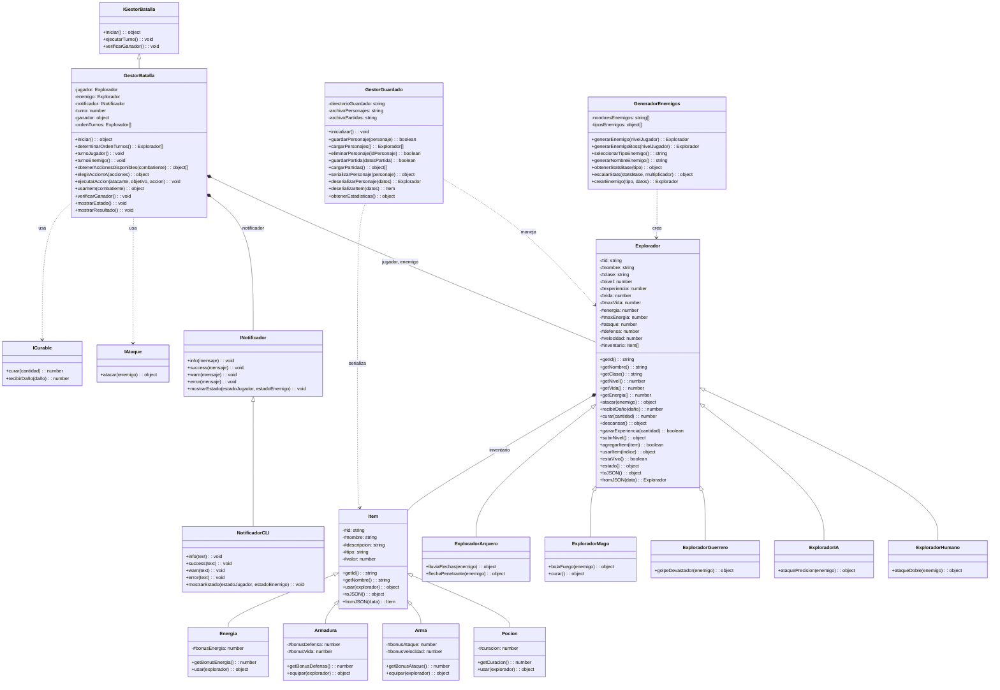

# Diagrama UML - Galaxy Sprint Batallas Espaciales

## Diagrama de Clases

## Principios SOLID Aplicados

### 1. Single Responsibility Principle (SRP)
- **Explorador**: Responsable únicamente de representar un personaje
- **GestorBatalla**: Solo maneja la lógica de batallas
- **GestorGuardado**: Solo se encarga del guardado/carga
- **GeneradorEnemigos**: Solo genera enemigos aleatorios
- **NotificadorCLI**: Solo maneja la salida por consola

### 2. Open/Closed Principle (OCP)
- Se pueden añadir nuevas clases de exploradores sin modificar las existentes
- Se pueden añadir nuevos tipos de items sin cambiar la clase base
- El sistema de batallas es extensible para nuevas habilidades

### 3. Liskov Substitution Principle (LSP)
- Todas las subclases de Explorador pueden usarse como instancias de la clase base
- Todas las subclases de Item implementan correctamente el método usar()
- NotificadorCLI puede sustituir a INotificador

### 4. Interface Segregation Principle (ISP)
- **IAtaque**: Solo para objetos que pueden atacar
- **ICurable**: Solo para objetos que pueden ser curados
- **INotificador**: Solo para sistemas de notificación
- **IGestorBatalla**: Solo para gestores de batalla

### 5. Dependency Inversion Principle (DIP)
- GestorBatalla depende de INotificador, no de NotificadorCLI directamente
- Las clases dependen de abstracciones (interfaces) no de implementaciones concretas
- El sistema es fácilmente extensible con nuevos tipos de notificadores

## Características de POO Implementadas

### Herencia
- Explorador como clase base con subclases especializadas
- Item como clase base para diferentes tipos de objetos

### Polimorfismo
- Métodos sobrescritos en las subclases (ataqueDoble, bolaFuego, etc.)
- Diferentes comportamientos según el tipo de explorador

### Encapsulamiento
- Propiedades privadas con # en las clases
- Métodos públicos para acceder a la información
- Métodos privados para funcionalidad interna

### Relaciones entre Clases
- **Composición**: Explorador contiene Items en su inventario
- **Agregación**: GestorBatalla usa Exploradores
- **Dependencia**: Servicios dependen de interfaces
